# Estructuras en C

## 1. Conceptualizacion

Anteriormente vimos que los **arrays** esta una coleccion de datos de un mismo tipo agrupados bajo un mismo nombre. C, pese a no ser un lenguaje de programacion orientado a objetos maneja un tipo de dato compuesto conocido como **estructura**. En si, una estructura es lo mas cercano a la definición que conocemos de **clase** en los lenguajes de programación, la unica diferencia respecto a las clases (sin hablar en el sentido estricto de la palabra), es que una estructura es como una clase con miembros pero sin metodos.

La mayor ventaja de estas, es que permiten la creacion de **nuevos tipos de datos**, liberando al programador de tener que restringirse 
al uso de los tipos de datos tipicos ofrecidos por el lenguaje como tal (int, double, float, etc.) lo cual hace posible organizar datos complicados, particularmente en largos programas.

Una **estructura**, es una coleccion de uno o más tipos de datos denominados **miembros**, cada uno de los cuales (como se dijo antes) puede ser de un tipo diferente. 

## 2. Trabajando con estructuras

### 2.1. Declaración de una estructura

La declaración de una estructura tiene la siguiente sintaxis:

```C
struct nombre-estructura {
  tipo_1 miembro_1;
  tipo_2 miembro_2;
  tipo_3 miembro_3;
  ...
  tipo_N miembro_N;
};
```

**Ejemplos**

1. Definir una estructura asociada a un punto en el plano cartesiano.

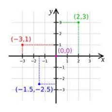

**Figura 1**. Punto.

```C
struct Punto2D {
  float x;
  float y;
};
```

2. Definir una estructura asociada a una fecha.

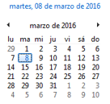

**Figura 2**. Fecha.

```C
struct Date {
  unsigned year;
  unsigned month;
  unsigned day;
};
```

3. Definir una estructura asociada a una hora.

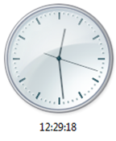

**Figura 3**. Tiempo

```C
struct Tiempo {
  unsigned int hr;
  unsigned int min;
  unsigned int sec;
};
```

4. Definir una estructura asociada a un album musical

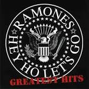

**Figura 4**. Album

```C
struct Album {
  char titulo[64];
  char artista[32];
  char genero[32];
  char *canciones;
};
```

5. Definir una estructura asociada a una cancion.

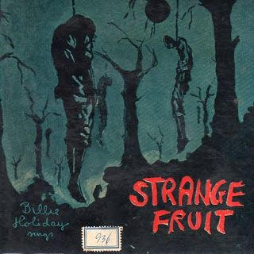

**Figura 5**. Cancion.

```C
struct Cancion {
  char titulo[64];
  char artista[32];
  char compositor[32];
  short duracion;
  struct fecha f_publicacion;
};
```

6. Definir una estructura asociada a un libro.

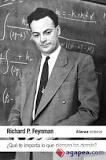

**Figura 6**. Libro.

```C
struct Book  {
   int  book_id;
   char title[50]; 
   char author[40]; 
   int pages;
   float price;
};

```

### 2.2. Definición de variables tipo struct

Las variables de estructuras se pueden definir de dos formas:
1. Listándolas inmediatamente después de la llave de cierre de la llave de cierre de la declaración de la estructura, algo como esto. Por ejemplo ([codigo](https://goo.gl/BKZ4tR)):

```C
struct Book  {
   int  book_id;
   char title[50]; 
   char author[40]; 
   int pages;
   float price;
} book1, book2;
```

2. Listando el tipo de la estructura seguida por las variables correspondientes en cualquier lugar del programa antes de utilizarlas, así, asumiendo que la estructura está declarada. Por ejemplo ([codigo](https://goo.gl/18uq3R)):

```C
struct Book  {
   int  book_id;
   char title[50]; 
   char author[40]; 
   int pages;
   float price;
}; 

struct Book book1, book2;
```
La salida sea para uno u otro caso se muestra a continuación:


**Figura 7**. Estructuras tipo libro.


Adicionalmente, los conceptos aplicados para los tipos de datos simples aplican para estructuras tambien; esto es, es posible crear variables normales, arrays, matrices y apuntadores de estructuras entre otros. Veamos:

**Ejemplo**:
Empleando la estructura tipo Punto2D crear las siguientes variables:
* Dos variables llamadas p1 y p2 (local).
* Un array de 3 elementos llamado vP (local).
* Un apuntador llamado *ptrP que apunte a p[1] (global).
* Una matrix de 2x2 llamada mP (global).

La [solución](https://goo.gl/kqGmJz) se muestra a continuación:

```C
struct Punto2D {
  float x;
  float y;
};

struct Punto2D vP[3];
struct Punto2D mP[2][2];
int main() {
  // Los datos tipo Punto2D seran locales
  struct Punto2D p1, p2;  
  struct Punto2D *ptrP = &vP[1];  
  return 0;
}
```

A continuacion se muestra el resultado en memoria de la ejecución del codigo anterior:

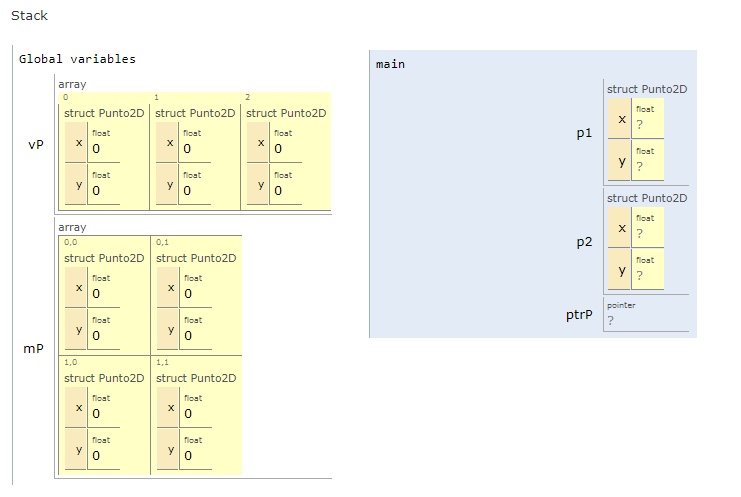

**Figura 8**. Estructuras tipo punto.

### 2.3. Inicializacion de variables tipo struct

Al igual que para el caso de las variables simples, las estructuras pueden tener valores iniciales una vez se declaran. Como estas con estructuras compuestas, lo que se hace para inicializar estas, es inicializar miembro por miembro. A continuacion se describen las dos formas de llevar a cabo esto:

#### 2.3.1. Usando una lista de inicialización
Esta es similar a la empleada para los arrays, y lo que se hace es inicializar cada miembro de la estructura con el correspondiente valor inicial asociado. Cada valor inicial es separado por coma (,). Veamos.

**Ejemplo** 
Iniciar la estructura Cancion con la siguiente informacion asociada a una cancion de [Billie Holiday](https://es.wikipedia.org/wiki/Billie_Holiday). A continuacion se muestra el [codigo](https://goo.gl/PThJor):

```C
// Declaracion de la estructura
struct Cancion {
  char titulo[20];
  char artista[32];
  char compositor[32];
  short duracion;
  char URL[32];
};
                         
// Funcion main                         
int main() {
  // Inicializacion de la variable (sadSong) tipo struct Cancion 
  struct Cancion sadSong = {
                              "Strange fruit",
                              "Billie Holiday",
                              "Abel Meeropol",
                              164,
                              "http://bit.ly/1mU1gBT"
                           }; 
  return 0;
}
```

A continuacion se muestra como quedan las estructura tipo Cancion (sadSong) al ejecutarse el codigo:

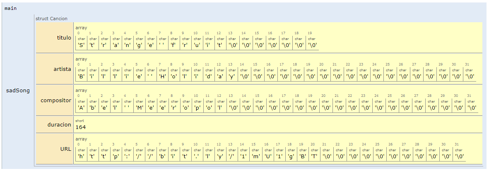

**Figura 9**. Estructuras tipo cancion (variable sadSong).

#### 2.3.2. Inicialización específica de cada uno de los miembros
Básicamente, consiste en la designación de cada uno de los miembros siguiendo la siguiente forma.

```C
.miembro = valor; // designador
```

**Ejemplo** 
Realizar la misma inicilizacion del caso anterior, pero en este caso emplear la inicializacion especifica de miembros (Ver el siguiente [enlace](https://goo.gl/DeHKrG)).

```C
// Declaracion de la estructura
struct Cancion {
  char titulo[20];
  char artista[32];
  char compositor[32];
  short duracion;
  char URL[32];
};
                         
// Funcion main                         
int main() {
  // Inicializacion de la variable (sadSong) tipo struct Cancion 
  struct Cancion sadSong = {
                             .titulo = "Strange fruit",
                             .artista = "Billie Holiday",
                             .compositor = "Abel Meeropol",
                             .duracion = 164,
                             .URL = "http://bit.ly/1mU1gBT"
                           };
  return 0;
}
```

El resultado de ejecutar el codigo anterior, es el mismo que el mostrado en la **figura 9**.

#### 2.3.3. Caso en el que no se inicializan todos lo miembros
Ya sea que se emplee una u otra de las formas anteriormente mencionadas, es posible inicializar parcialmente una variable tipo estructura, para ello, basta con no pasar todos los elementos que puede contener la lista de inicialización. A continuación se muestra un ejemplo:

**Ejemplo**
Crear dos variables tipo struct Cancion, estas variables no tendran todos los parametros inicialidos (ver el siguiente [enlace](https://goo.gl/p8qxYn)):

```C
// Declaracion de la estructura
struct Cancion {
  char titulo[20];
  char artista[32];
  char compositor[32];
  short duracion;
  char URL[32];
};

// Variables globales tipo struct Cancion
struct Cancion song1 = {"Mi cerebro esta boca abajo"};
struct Cancion song2 = { 
                         .titulo = "Noches de Hungria",
                         .compositor = "Julio Jaramillo",
                         .duracion = 127
};

// Funcion main                         
int main() {
  return 0;
}
```

En la siguiente figura se muestra el resultado del codigo anterior, notese lo que sucede como quedan los miembros que no fueron inicializados.

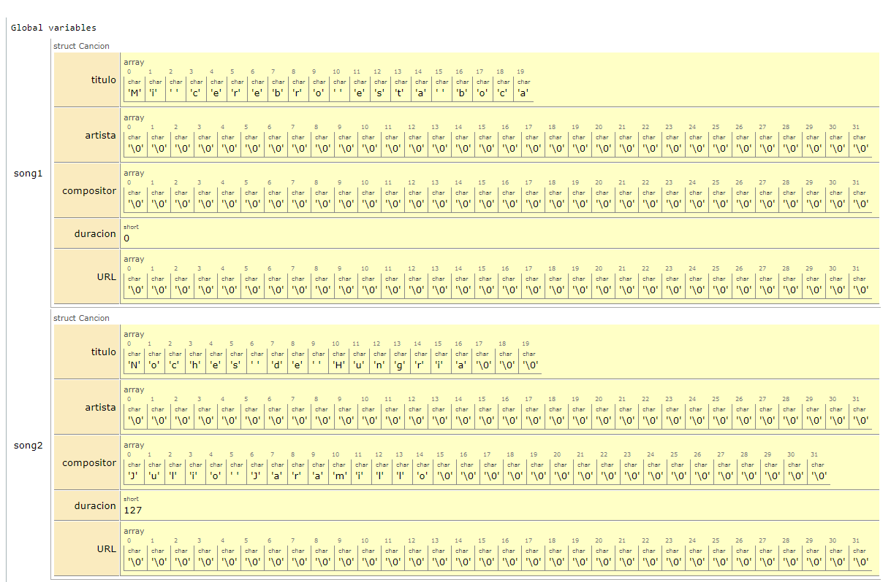

**Figura 10**. Variables tipo cancion sin inicializar todos sus miembros.

### 2.4. Empleo de la palabra clave typedef para crear alias (tocayos)
La palabra reservada ```typedef``` permite a un programador crear un sinónimo de un tipo de dato definido por el usuario o de un tipo ya existente. La sintaxis para usar esta palabra clave es la siguiente:

```C
tipo_dato typedef nombre_alias;
```

**Ejemplo**
Dada la siguiente declaracion de variables:

```C
double alto, ancho;
```

Teniendo en cuenta que **alto** y **ancho** son medidas de longitud, podemos crear un alias para una variable tipo double llamado **longitud** y el efecto será el mismo que el del caso anterior, el código para el caso sera el siguiente:

```C
typedef double longitud;
longitud alto, ancho;
```

El resultado se muestra a continuacion:

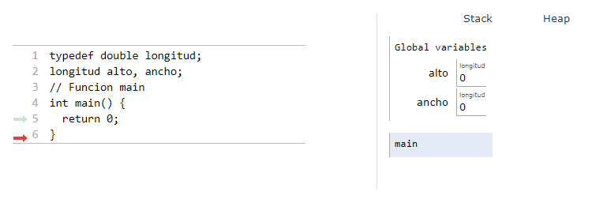

**Figura 11**. Uso de typedef para la creacion de alias.

**Ejemplo**
La mayor ventaja del uso de esta palabra clave se ve con las estructuras. A continuación se muestra el resultado:

1. Cree dos variables tipo Punto2D llamadas P1 y P2 con valores (2,3) y (-1,6). No emplee typedef ([codigo](https://goo.gl/12SyAa))


```C
// Declaracion de las estructura
struct Punto2D {
  float x;
  float y;
};


// Funcion main                         
int main() { 
  // Declaracion de variables
  struct Punto2D P1 = {
                        2,
                        3
                      };

  struct Punto2D P2 = {
                        .x = -1,
                        .y = 6
                      };
  return 0;
}
```

La salida del programa anterior es:

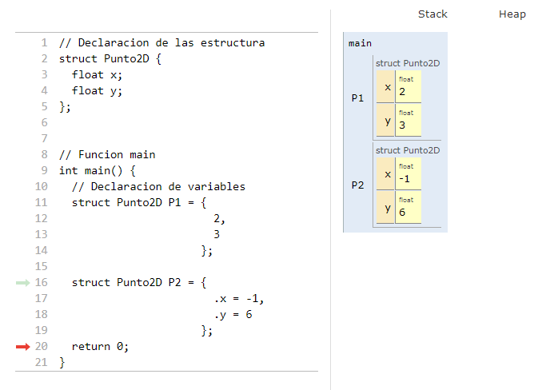

**Figura 11**. Uso variables tipo struct Punto2D sin usar typedef.

2. Realice lo mismo que en el punto anterior, pero esta vez haga uso de la palabra clave **typedef** para crear un alias son **struct Punto2d** llamado **Punto2D**. (ver siguiente [enlace](https://goo.gl/2nfGgb)) 


```C
// Declaracion de las estructura
struct Punto2D {
  float x;
  float y;
};

// Creacion del alias
typedef struct Punto2D Punto2D;

// Funcion main                         
int main() { 
  // Declaracion de variables
  Punto2D P1 = {
                        2,
                        3
                      };

  Punto2D P2 = {
                        .x = -1,
                        .y = 6
                      };
  return 0;
}
```

La salida del programa anterior (observe en que se diferencia respecto al anterior) es:

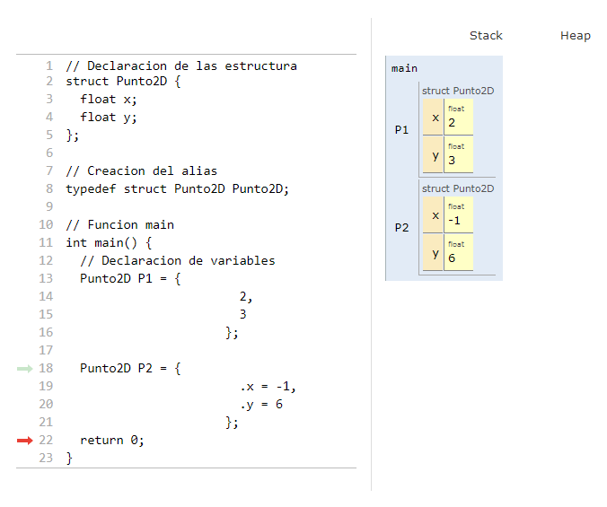

**Figura 12**. Uso variables tipo struct Punto2D usando typedef.

### 2.5. Manipulando estructuras
Por manipulacion de la estructuras (dentro de este contexto) nos queremos referir al acceso a los miembros de esta, tal y como sucede cuando se accede a los miembros de un objeto en el caso de la POO. Para el caso de las estructuras en particulas, existen dos formas de acceder:
* Empleando el operador punto (.)
* Emplenando el operador flecha (->)

#### 2.5.1 Usando el operador punto (.)
Usado cuando se definen variables del tipo de la estructura. Básicamente tiene la siguiente sintaxis:

```C
<nombre_variable_estructura>.<nombre_miembro> = datos;
```
**Ejemplos**
1. Crear dos puntos P1 y P2. Luego de su declaracion inicialicelos con los siguientes valores: (1,1) y (10,3). En el siguiente [enlace](https://goo.gl/XzWLMR) se encuentra el codigo.

```
// Declaracion de las estructura
struct Punto2D {
  ...
};

// Creacion del alias
struct Punto2D Punto2D;

// Declaracion de los puntos
Punto2D P1, P2;

// Manipulacion (acceso a los miembros)
P1.x = 1;
P1.y = 1;
P2.x = 10, P2.y = 3;
```

Observe como quedan los campos de las variables P1 y P2 despues de la ejecucion del codigo anterior.

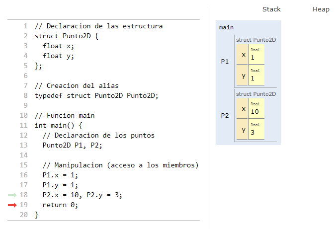

**Figura 13**. Manipulando variables tipo Punto2D.

2. Crear una estructura asociada a un libro y porteriormente declarar dos libros (como un array) con la siguiente informacion.

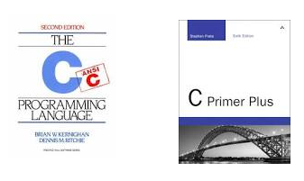

**Figura 13**. Libros.

<table style="width: 91px;">
<tbody>
<tr>
<td style="width: 15px;">#</td>
<td style="width: 15px;">BookID</td>
<td style="width: 15px;">Title</td>
<td style="width: 15px;">Author</td>
<td style="width: 15px;">Pages</td>
<td style="width: 15px;">Price</td>
</tr>
<tr>
<td style="width: 15px;">1</td>
<td style="width: 15px;">1211</td>
<td style="width: 15px;">C Primer Plus</td>
<td style="width: 15px;">Stephen Prata</td>
<td style="width: 15px;">984</td>
<td style="width: 15px;">585.00</td>
</tr>
<tr>
<td style="width: 15px;">2</td>
<td style="width: 15px;">1212</td>
<td style="width: 15px;">The ANSI C Programming</td>
<td style="width: 15px;">Dennis Ritchie</td>
<td style="width: 15px;">214</td>
<td style="width: 15px;">125.00</td>
</tr>
</tbody>
</table>

El [código](https://goo.gl/dbjcTF) solucion se muestra a continuación, note que la forma como se accede a la variable tipo ```Book``` en el correspondiente arreglo es ```book[i]``` para el caso, por ende la forma de acceder a cada uno de los miembros del array en cuestion será ```book[i].miembro```

```C
#include <stdio.h>
#include <string.h>

// Declaracion de las estructura
struct Book  {
   int  book_id;
   char title[24]; 
   char author[20]; 
   int pages;
   float price;
};

// Creacion del alias
typedef struct Book Book;

// Declaracion del array de libros
Book books[2];

int main() {
  // Manipulacion (acceso a los miembros)

  // Libro # 1
  books[0].book_id = 1211;
  //OJO: books[0].title = "C Primer Plus" es un ERROR 
  strcpy(books[0].title,"C Primer Plus");    
  strcpy(books[0].author,"Stephen Prata"); 
  books[0].pages = 984;
  books[0].price = 585.00;

  // Libro #2
  books[1].book_id = 1212;
  strcpy(books[1].title,"The ANSI C Programming"); 
  strcpy(books[1].author,"Dennis Ritchie"); 
  books[1].pages = 214;
  books[1].price = 125.00;

  return 0;
}
```

A continuacion se muestra el resultado en memoria.:


**Figura 14**. Resultado en memoria para variables asociadas a los libros.

2.5.2 Usando el operador flecha (->)
Es empleado cuando se hace uso de punteros a estructuras, su sintaxis es de la siguiente forma:

```C
<puntero_estructura>-><nombre_miembro> = datos;
```

**Ejemplos**
1. Suponga que se tiene una estructura asociada a las fechas. Tambien, suponga que tiene una variable llamada diaDestino cuyo valor asociado es el 5 de noviembre de 1955 (primer viaje en el tiempo de Marty MacFly). Luego cree una variable tipo apuntador a esta este tipo de estructura y modifique a traves de este el valor de diaDestino al 21 de octubre de 2015 (fecha a la cual viaja Marty MacFly al futuro). Imprima los valores en cada caso.

El [codigo](https://goo.gl/cGBQeP) solucion se muestra a continuacion:

```C
#include <stdio.h>

struct Date {
  unsigned year;
  unsigned month;
  unsigned day;
};

typedef struct Date Fecha;

int main() {
  /* Declaracion de variables */
  Fecha diaDestino; // Varible tipo fecha
  Fecha *diaPtr;    // Variable tipo apuntador a fecha
  diaPtr = &diaDestino;  // Inicializacion del apuntador
  
  /* Viaje al pasado */
  // Fijando por medio del operador punto (.) los valores 
  // de dia destino al 5 de noviembre de 1955 
  diaDestino.year = 1955;
  diaDestino.month = 11;
  diaDestino.day = 5;
  printf("Destination time: %d/%d/%d\n", 
         diaDestino.day, diaDestino.month, diaDestino.year);
  
  /*Viaje al futuro */
  // Fijando por medio del operador flecha (->) los valores 
  // de dia destino al 21 de octubre de 2015
  diaPtr->year = 2015;
  diaPtr->month = 10;
  diaPtr->day = 21;
  printf("Destination time: %d/%d/%d\n", 
         diaPtr->year, diaPtr->month, diaPtr->year);
  return 0;
}
```

A continuacion se muestra la salida asociada al ejemplo anterior:


**Figura 15**. Salida empleando notacion puntero 

Hay que aclarar que el uso del operador punto (.) tambien puede ser empleado con variables tipo apuntador, para ello se sigue la siguiente forma:

**Ejemplos**
1. Implemente el mismo ejemplo anterior, pero esta vez use el operador punto (.) para modificar los miembros de la variable tipo Date a traves del apuntador.

El [codigo solucion](https://goo.gl/kMb6kb) se muestra a continuacion:

```C
#include <stdio.h>

struct Date {
  unsigned year;
  unsigned month;
  unsigned day;
};

typedef struct Date Fecha;

int main() {
  /* Declaracion de variables */
  Fecha diaDestino; // Varible tipo fecha
  Fecha *diaPtr;    // Variable tipo apuntador a fecha
  diaPtr = &diaDestino;  // Inicializacion del apuntador
  
  /* Viaje al pasado */
  // Fijando por medio del operador punto (.) los valores 
  // de dia destino al 5 de noviembre de 1955 
  diaDestino.year = 1955;
  diaDestino.month = 11;
  diaDestino.day = 5;
  printf("Destination time: %d/%d/%d\n", 
         diaDestino.day, diaDestino.month, diaDestino.year);
  
  /*Viaje al futuro */
  // Fijando por medio del operador flecha (->) los valores 
  // de dia destino al 21 de octubre de 2015
  (*diaPtr).year = 2015;
  (*diaPtr).month = 10;
  (*diaPtr).day = 21;
  printf("Destination time: %d/%d/%d\n", 
         diaPtr->year, diaPtr->month, diaPtr->year);
  return 0;
}
```

Si lo simula, podrá notar que la salida es exactamente la misma que la del ejemplo anterior.

### 2.6. Estructuras anidadas
Una estructura puede tener a su vez otra estructura como miembro. A continuacion se muestra un ejemplo para ello.

**Ejemplos**
1. Suponga que se tiene la siguiente tabla asociada a personajes historicos.


**Figura 16**. Personajes

<table>
<tbody>
<tr>
<td>Nombre</td>
<td>Nacimiento</td>
<td>Muerte</td>
<td>Profesion</td>
</tr>
<tr>
<td>Ernest Hemingway</td>
<td>21/07/1899</td>
<td>02/07/1961</td>
<td>Escritor</td>
</tr>
<tr>
<td>Albert Einstein</td>
<td>14/03/1879</td>
<td>18/04/1955</td>
<td>Fisico</td>
</tr>
</tbody>
</table>

Note que para el problema podemos crear dos estructuras, una asociada al personaje y otra asociada a las fechas. Asi mismo, podemos ver que las fechas pueden ser tratadas como estructuras del personaje. A continuacion vamos a mostrar el código que define ambas estructuras:

```C
struct date {
  unsigned year;
  unsigned month;
  unsigned day;
};

typedef struct date fecha;

struct personajeHistorico {
  char nombre[21];
  fecha nacimiento;
  fecha muerte;
  char profesion[21];
};

typedef struct personajeHistorico personaje;


int main() {
  
  personaje per1 = {
                     .nombre = "Ernest Hemingway",
                     .nacimiento = {
                       .year = 21, 
                       .month = 07,
                       .day =  1899,
                      },
                     .muerte = { 02, 07, 1961 },
                     .profesion = "Escritor"                  
                   };
  personaje per2, *ptr;
  fecha d = {14, 03, 1879};  
  ptr = &per2;
  strcpy(per2.nombre,"Albert Einstein");
  strcpy(ptr->profesion,"Fisico");
  (*ptr).nacimiento = d;
  per2.muerte.year = 1955;
  per2.muerte.month = 4;
  per2.muerte.day = 18;
  return 0;
}
```

Notese que en el anterior [ejemplo](https://goo.gl/wFkkgf), se combinan varias de las cosas que hemos discutido previamente. El resultado en memoria se muestra a continuacion:

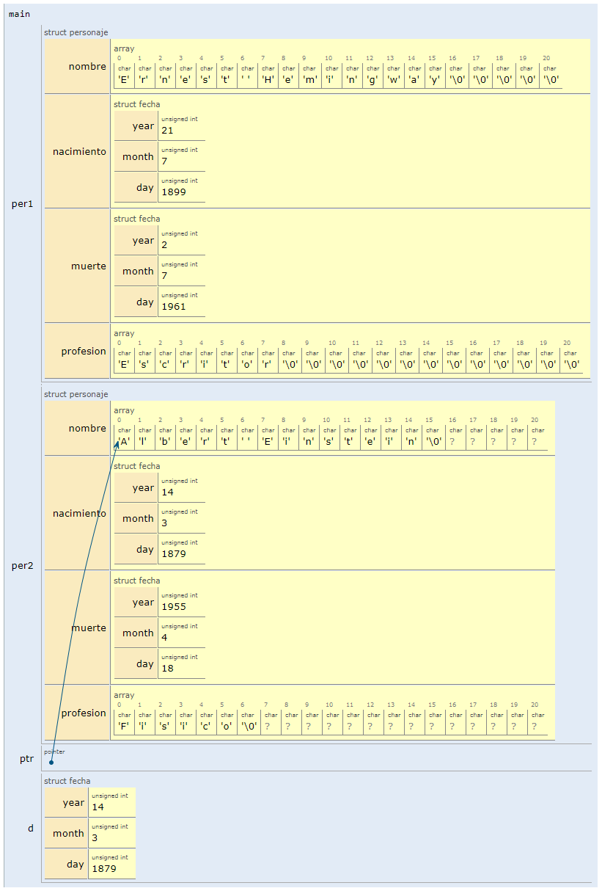

**Figura 17**. Resultado en memoria cuando existen estructuras anidadas.

### 2.6. Estructuras y funciones
Los conceptos vistos hasta el momento sobre funciones tambien aplican a las estructuras ya que las estructuras pueden ser usadas como parametros y valores de retorno por citar unos cuantos casos. La unica cosa adicional, respecto a las funciones que trabajan con variables normales, es que las funciones con estructuras hacen uso de los operadores de acceso para la manipulacion y el procesamiento de los datos de acuerdo a lo que se desea que haga la funcion. Como en el caso tradicional, las funciones en las que se emplean estructuras pueden ser pasadas por valor y por referencia. A continuacion se describe cada caso:

### 2.6.1. Paso de estructuras por valor
En este caso la estructura pasada como argumento a la funcion es copiada al parametro de la funcion, de modo que el procesamiento se hace sobre la copia y no sobre la estructura pasada como argumento.

**Ejemplos**
1. Definir una estructura que este asociada a un numero completo. Luego haga una funcion que imprima el numero complejo en cuestion en la forma **parteReal + parteImaginaria*i**. Luego probar el programa para imprimir los numeros: 2, -3*i, -2.3 + 10.5*i, 1.23 - 3.67*i

El codigo solucion se puede simular en el siguiente [enlace](https://goo.gl/juQdWh): 
```C
#include <stdio.h>

/** Declaracion de  estructuras */
typedef struct complejo {
  float re;
  float im;
} complejo;

/** Declaracion de funciones */
void imprimirComplejo(complejo); // void imprimirComplejo(complejo num)

/** Funcion main */
int main() {
  /* Creando los numeros */
  complejo n1 = {2, 0}; // 2
  complejo n2 = {.re = 0, .im = -3}; // -3*i
  complejo n3, n4;
  n3.re = -2.3; // -2.3 + 10.5*i
  n3.im = 10.5;
  n4.re = 1.23; //  1.23 - 3.67*i
  n4.im = -3.67;
  /* Llamando las funciones para imprimir */
  imprimirComplejo(n1);
  printf("\n");
  imprimirComplejo(n2);
  printf("\n");
  imprimirComplejo(n3);
  printf("\n");
  imprimirComplejo(n4);
  printf("\n");
  return 0;
}

/** Definicion de funciones */
void imprimirComplejo(complejo num) {
  if (num.im == 0) {
    // Real puro
    printf("%.2f",num.re);
  }
  else if (num.re == 0) {
    // Imaginario puro
    printf("%.2f*i",num.im);
  }
  else if (num.im < 0) {
    // Complejo con parte imaginaria negativa
    printf("%.2f - %.2f*i",num.re,(-1)*num.im);
  }
  else {
    // Complejo con parte imaginaria positiva
    printf("%.2f + %.2f*i",num.re,num.im);
  }  
}
```

Notese que en el anterior codigo se empleo ```typedef``` al declarar la estructura para definir de una vez el alias. La salida en pantalla y la representacion en memoria del programa anterior se muestra a continuacion.


2. En la anterior funcion se un numero complejo como parametro, sin embargo tambien es posible retornar otras estructuras variables de retorno. Para ello en el siguiente ejemplo:
* Hacer una funcion que sume dos numeros complejos y retorne el resultado de realizar la suma como otro complejo.
* Hacer un test sumando los numeros: 2 - 11*i y 8 + 9*i

```C
#include <stdio.h>

/** Declaracion de  estructuras */
typedef struct complejo {
  float re;
  float im;
} complejo;

/** Declaracion de las funciones  */
void imprimirComplejo(complejo);
complejo sumarComplejos(complejo, complejo);
void test(void); // Funcion para testing

/** Funcion main */
int main() {
  /* Probando todo mediante la funcion test */
  test();
  return 0;
}

/** Definicion de funciones */
void imprimirComplejo(complejo num) {
  if (num.im == 0) {
    // Real puro
    printf("%.2f",num.re);
  }
  else if (num.re == 0) {
    // Imaginario puro
    printf("%.2f*i",num.im);
  }
  else if (num.im < 0) {
    // Complejo con parte imaginaria negativa
    printf("%.2f - %.2f*i",num.re,(-1)*num.im);
  }
  else {
    // Complejo con parte imaginaria positiva
    printf("%.2f + %.2f*i",num.re,num.im);
  }  
}

complejo sumarComplejos(complejo c1, complejo c2) {
    complejo solucion;
    solucion.re = c1.re + c2.re;
    solucion.im = c1.im + c2.im;
    return solucion;
}

void test(void) {
  complejo c1 = {2, -11}, c2 = {8, 9};
  complejo c3 = sumarComplejos(c1,c2);
  imprimirComplejo(c1);
  printf("\n");
  imprimirComplejo(c2);
  printf(" + \n---------\n");
  imprimirComplejo(c3);
}
```


## XX. Enlaces

* https://computer.howstuffworks.com
* https://www.studytonight.com/c/structures-in-c.php
* https://www.tutorialspoint.com/cprogramming/c_structures.htm
* https://www.programiz.com/c-programming/c-structures
* https://www.geeksforgeeks.org/structures-c/


