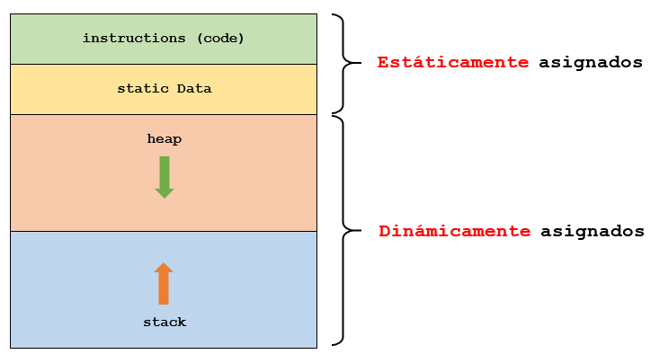

# Memoria dinamica en C

## 1. Introduccion

Comentarios

## 2. Espacios de memoria

De manera resumida la memoria de datos de un programa en C puede ser dividida en tres partes:
1. **Memoria estatica**: en esta se localizan todas las variables globales (aquellas que son definidas fuera de funciones),
tambien se localizan las variables locales (definidas dentro de funciones) que son explicitamente declaradas como estaticas.
2. **Stack**: lugar de la memoria en el cual se definen las variables locales (variables automaticas (no estaticas) declaradas dentro 
de la funcion), los parametros de las funciones y los valores retornados por las funciones.
3. **Heap**: lugar de la memoria disponible para asignacion dinamica (en tiempo de ejecicion) de memoria. 

La siguiente figura resalta los espacios anteriormente descritos:


**Figura 1**. Mapa de memoria

Para clarificar un poco lo anterior supongamos que se codifica el siguiente [programa](https://goo.gl/Z16WF6) en C:

```C
#include <stdio.h>

int x=5;
char msg[] = "Hello";

int main(int argc, const char* argv[]) {
  int v;
  float pi = 3.14159;
  printf("%d\n",x);
  printf("%f\n",pi);
  return 0;
}

```

Cuya salida al ejecutar el programa se muestra en la siguiente figura:


Como se puede ver de la figura anterior, se resaltan varios elementos 
